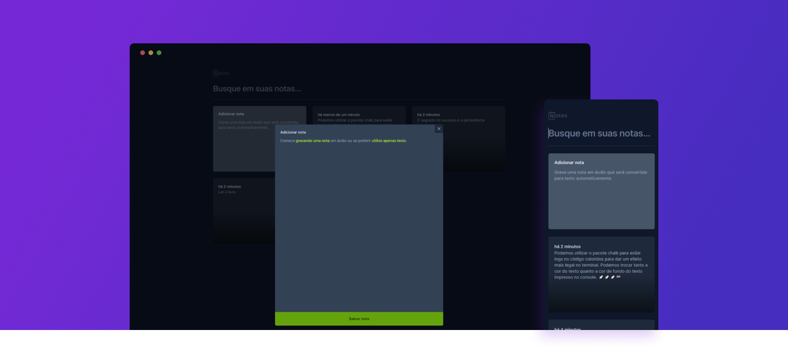

This application was developed using React, TypeScript, Tailwind and the SpeechRecognition API.<br/>
Essa aplicação foi desenvolvida utilizando React, TypeScript, Tailwind e a SpeechRecognition API.

## Running | Executando

After cloning the repository, access the project folder and execute the commands below:<br/>
Após clonar o repositório, acesse a pasta do projeto e execute os comandos abaixo:

```sh
npm install
npm run dev
```

Visit http://localhost:5173 to view the application.<br/>
Acesse http://localhost:5173 para visualizar a aplicação.